<p align="center">
  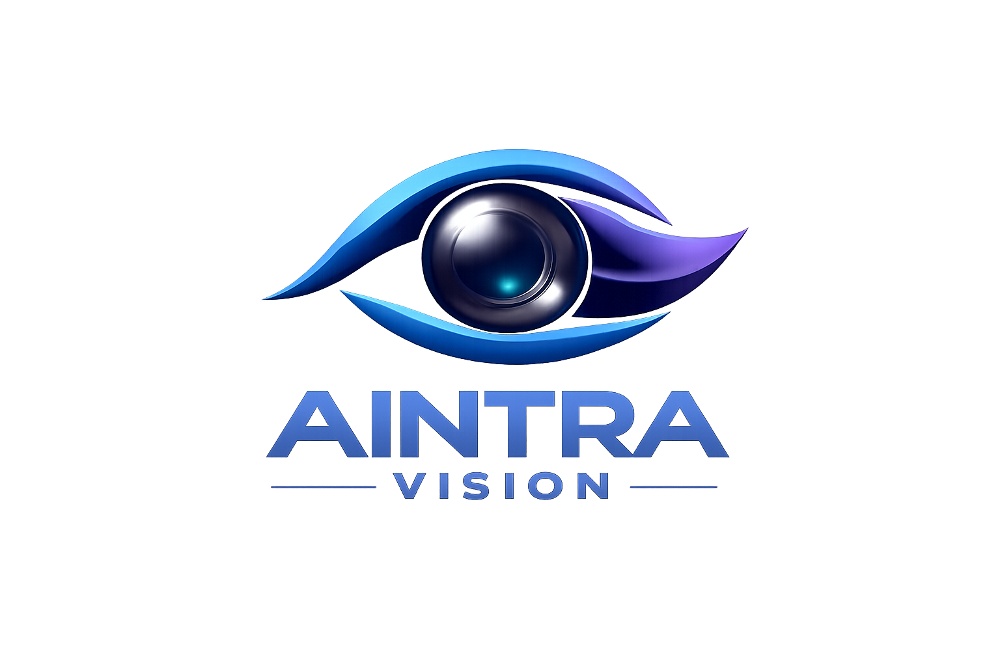
</p>
<h1 align="center">AIntra Vision</h1>
<p align="center"> 
  Toolkit pengolahan citra digital berbasis Next.js dan FastAPI.
</p>
<p align="center">
  
</p>

##   Tech Stack Preview
<p align="center">
  
</p>
<p align="center">
  
  
  
  
  
  
  
  
</p>
<p align="center">
  
  
  
</p>
<p align="center">
  
</p>
<p align="center">
  
  
  
  
  
  
</p>
<p align="center">
  
  
  
</p>
<p align="center">
  
</p>
<p align="center">
  
  
  
  
</p>

##   Ringkasan
-   Menyediakan 18 operasi pengolahan citra dari peningkatan, penyaringan, hingga segmentasi dan analisis.
-   UI modern dengan galeri operasi, panel parameter, dan pratinjau instan.
-   Backend FastAPI menangani upload, preview cepat, proses penuh, dan status realtime via WebSocket.
-   Artefak gambar disajikan melalui endpoint `/media` untuk pratinjau dan unduhan.
-   Dukungan metrik kualitas (PSNR/SSIM) tersedia untuk evaluasi hasil.

##   Tech Stack
  Ringkasan stack diambil dari `frontend/package.json` dan `backend/requirements.txt`.

### >  Frontend
-  Next.js - App Router dan dev server.
-  React - UI berbasis komponen.
-  Tailwind CSS v4 - styling utility-first.
-  TypeScript - type safety di UI.
-  Framer Motion - animasi interaktif.
-  Radix UI - primitives komponen aksesibel.
-  Zustand - state management ringan.
-  Zod - validasi schema di client.
-  React Dropzone - drag and drop upload.
-  Tabler Icons - set ikon UI.
-  Lucide React - ikon komponen.

###  Backend
-  Python - bahasa utama backend.
-  FastAPI - REST API dan WebSocket.
-  Uvicorn - ASGI server.
-  OpenCV - core image processing.
-  NumPy - operasi matriks.
-  scikit-image - util pengolahan citra lanjutan.
-  Pillow - I/O gambar.
-  python-multipart - upload form-data.
-  aiofiles - I/O async.

###  Tooling dan Testing
-  ESLint - linting frontend.
-  pytest - unit test backend.
-  pytest-asyncio - test async di FastAPI.
-  httpx - HTTP client untuk testing.

##  Arsitektur Singkat
-  Frontend Next.js mengirim request upload, preview, dan proses penuh ke backend.
-  Backend FastAPI memproses operasi citra dan menyimpan hasil ke storage lokal.
-  File hasil disajikan lewat `/media` untuk pratinjau dan download.
-  Progress realtime dikirim via WebSocket `/api/progress/{job_id}`.

##  Fitur dan Operasi
 Seluruh operasi diambil dari `backend/app/schemas.py` dan deskripsi dari `frontend/src/lib/operations.ts`.

|  Icon |  Operasi |  ID |  Kategori |  Ringkas |
|---|---|---|---|---|
|  | Negatif Citra | `negative` | Peningkatan | Membalik intensitas piksel untuk menonjolkan struktur dan teks. |
|  | Log Transform | `log` | Peningkatan | Ekspansi jangkauan intensitas untuk area gelap dan terang. |
|  | Gamma Correction | `gamma` | Peningkatan | Koreksi gamma adaptif untuk kontrol pencahayaan. |
|  | Histogram Equalization dan CLAHE | `histogram` | Peningkatan | Distribusi ulang histogram global atau lokal. |
|  | Histogram Matching | `histogram-match` | Peningkatan | Sesuaikan distribusi intensitas terhadap gambar target referensi. |
|  | Gaussian Blur | `gaussian` | Penyaringan | Pengaburan lembut untuk mereduksi noise gaussian. |
|  | Median Filter | `median` | Penyaringan | Filter median untuk noise impuls (salt and pepper). |
|  | Bilateral Filter | `bilateral` | Penyaringan | Pelunakan tepi sadar warna tanpa blur detail. |
|  | Penajaman Laplacian | `sharpen` | Tepi dan Detail | Penegasan detail via Laplacian dan unsharp masking. |
|  | Deteksi Tepi | `edge` | Tepi dan Detail | Sobel dan Canny untuk struktur kontur presisi. |
|  | Operasi Morfologi | `morphology` | Tepi dan Detail | Bersihkan noise dan struktur dengan kernel fleksibel. |
|  | Transformasi Geometri | `geometry` | Geometri | Rotasi, skala, translasi, dan crop adaptif. |
|  | Active Contour (Snakes) | `active_contour` | Segmentasi | Kontur aktif untuk mengikuti tepi atau objek secara halus. |
|  | Ekstraksi Ciri (Features) | `features` | Analisis | Bentuk, ukuran, geometri, tekstur (GLCM/LBP/HOG), warna. |
|  | HSV Threshold | `hsv-threshold` | Segmentasi | Segmentasi berbasis rentang warna pada ruang HSV. |
|  | K-Means Color | `kmeans-color` | Segmentasi | Klasterisasi warna untuk memisahkan area dominan. |
|  | Threshold Global | `threshold-global` | Segmentasi | Segmentasi sederhana dengan ambang global tetap. |
|  | Adaptive Threshold dan Otsu | `threshold-adaptive` | Segmentasi | Segmentasi adaptif dengan opsi Otsu otomatis. |

##  Demo Hasil Operasi
 Format gambar demo yang digunakan README ini: satu gambar per operasi dari folder `public/operasi/`.

###  Negatif Citra (`negative`)
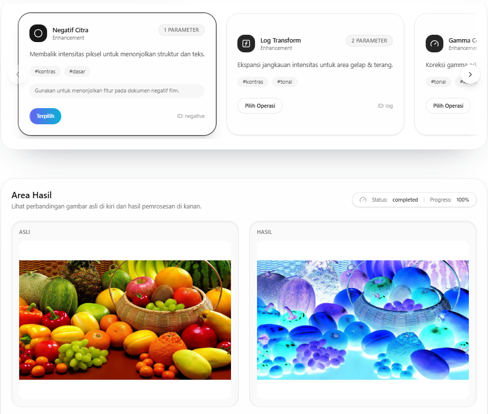

###  Log Transform (`log`)
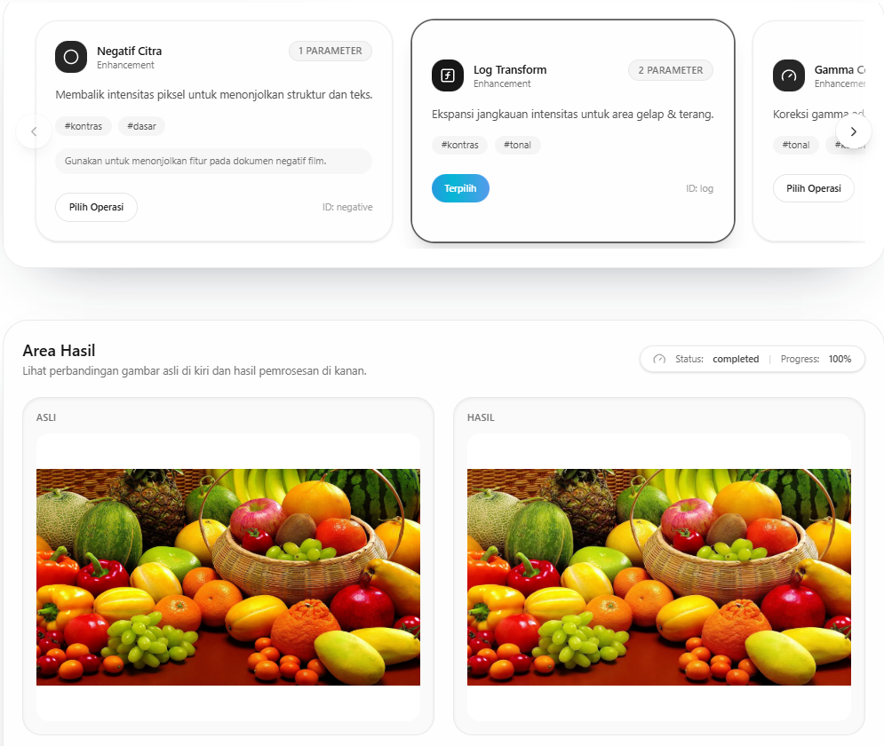

###  Gamma Correction (`gamma`)
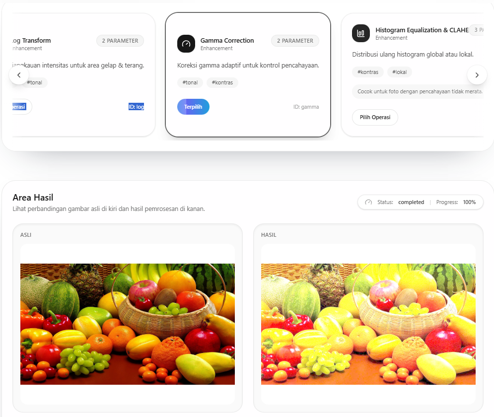

###  Histogram Equalization dan CLAHE (`histogram`)
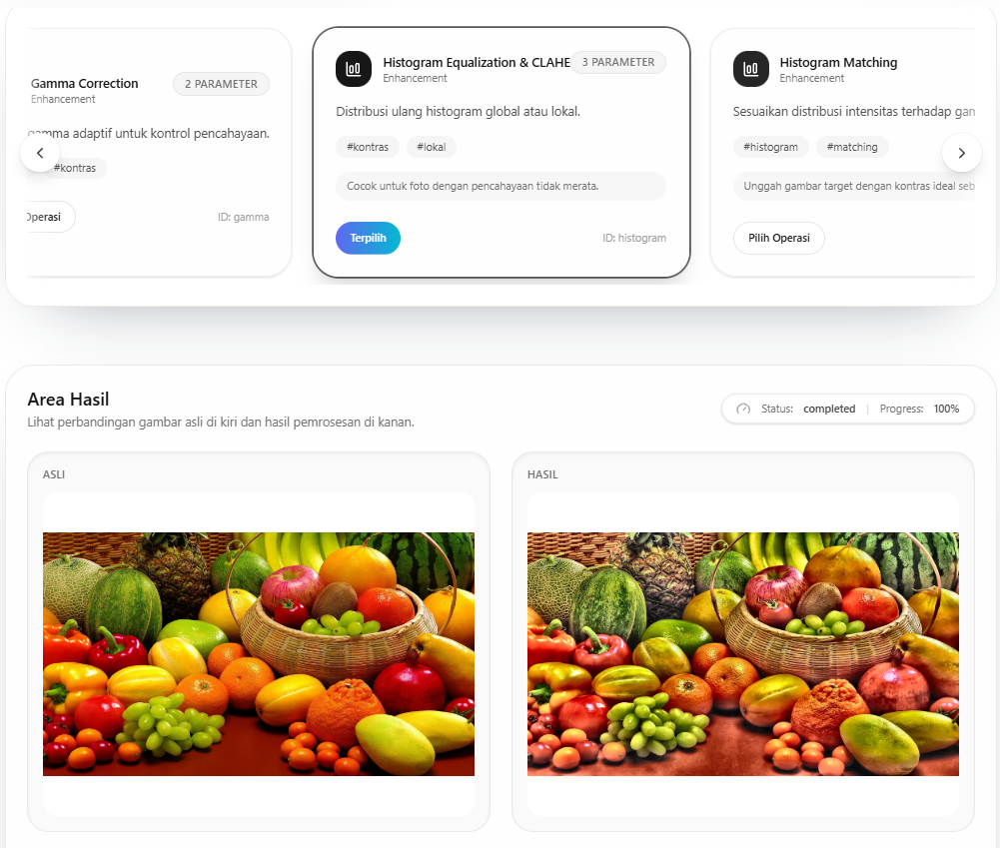

###  Histogram Matching (`histogram-match`)
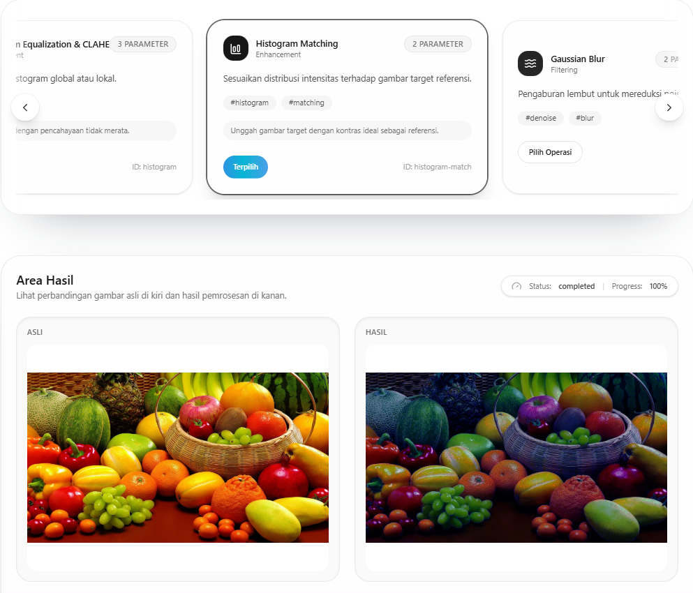

###  Gaussian Blur (`gaussian`)
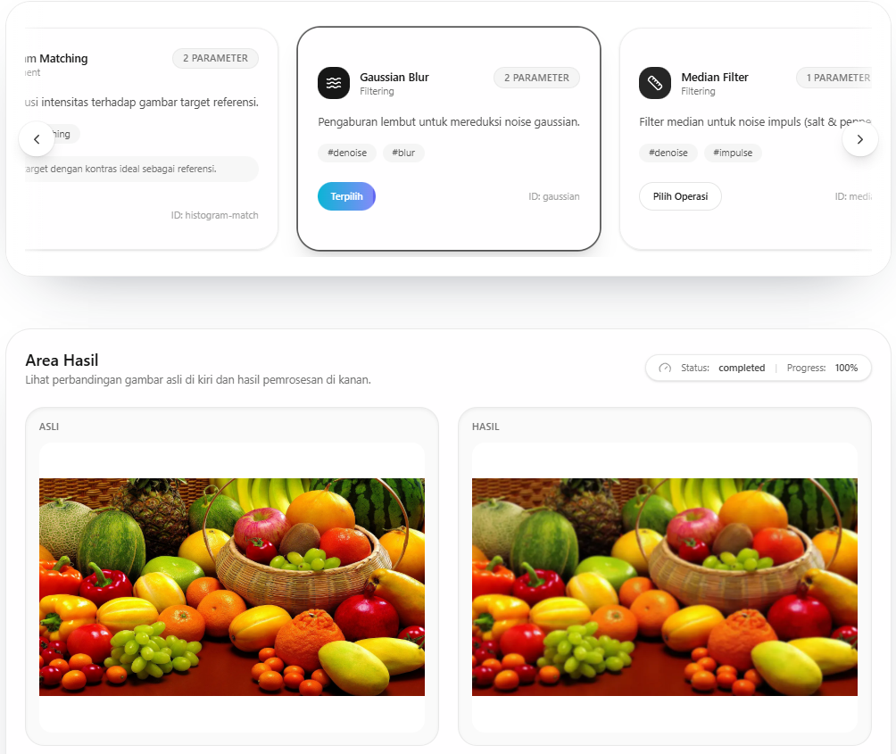

###  Median Filter (`median`)
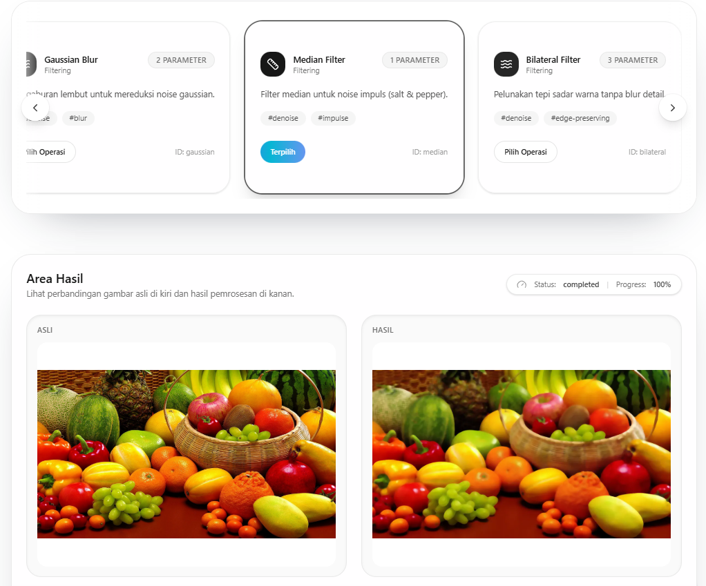

###  Transformasi Geometri (`geometry`)
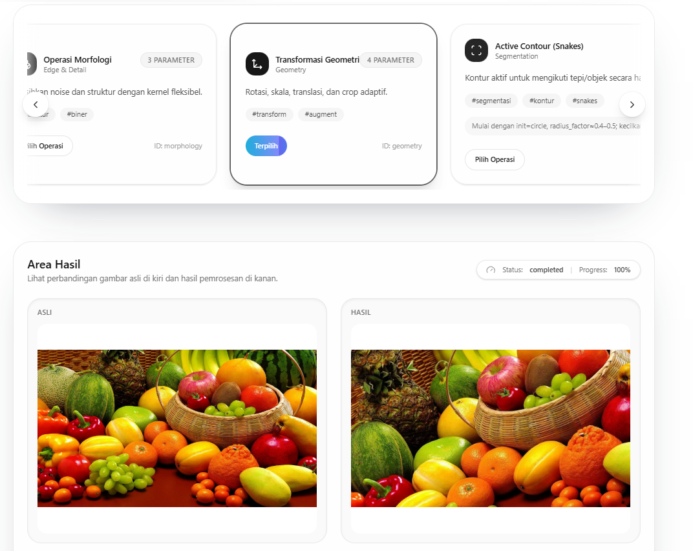

###  HSV Threshold (`hsv-threshold`)
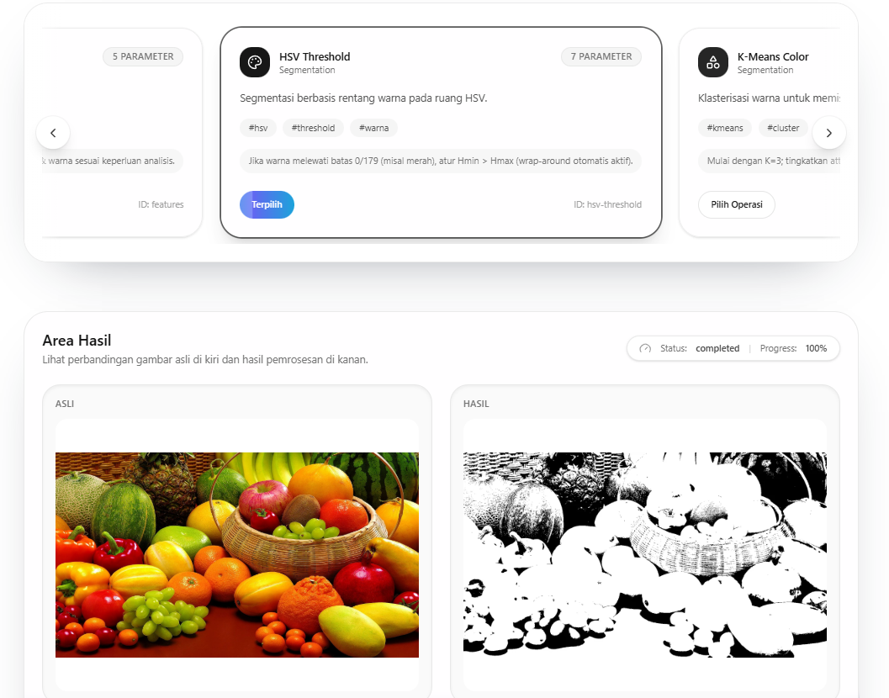

###  K-Means Color (`kmeans-color`)
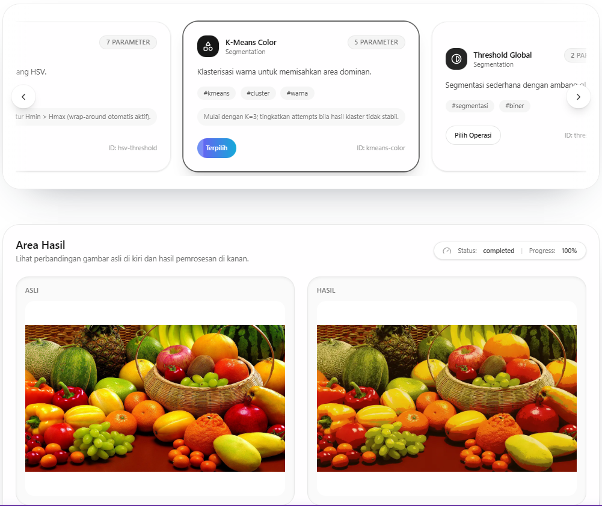

###  Threshold Global (`threshold-global`)
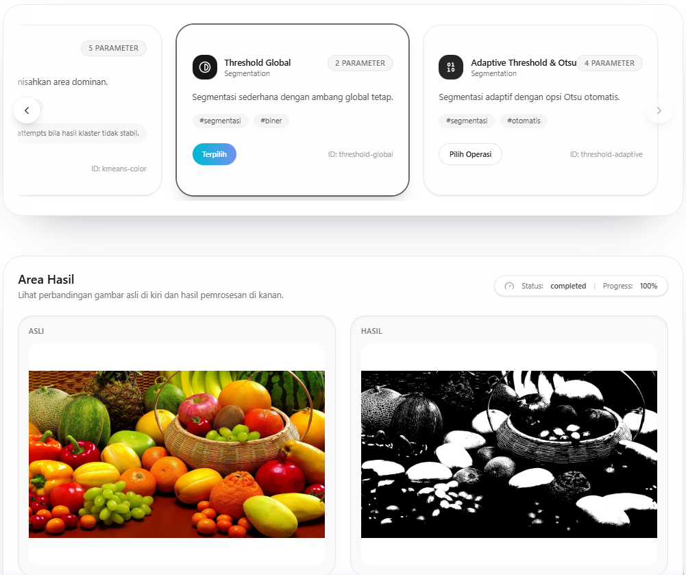

###  Adaptive Threshold dan Otsu (`threshold-adaptive`)
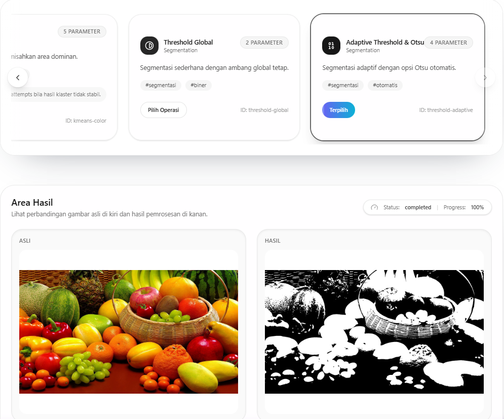

##  Cara Menjalankan

###  Backend (FastAPI)
 Jalankan perintah berikut di terminal:

```bash
cd backend
python -m venv .venv
source .venv/bin/activate  # Windows: .venv\Scripts\activate
pip install -r requirements.txt
uvicorn app.main:app --reload --host 0.0.0.0 --port 8000
```

###  Frontend (Next.js)
 Jalankan perintah berikut di terminal terpisah:

```bash
cd frontend
npm install
npm run dev
```

 Akses UI di `http://localhost:3000` dan API docs di `http://localhost:8000/docs`.

##  Konfigurasi Environment
-  `NEXT_PUBLIC_API_URL` - base URL backend untuk frontend. Default: `http://localhost:8000`.
-  `AINTRA_CORS` - daftar origin yang diizinkan (pisahkan dengan koma).
-  `AINTRA_STORAGE` - direktori penyimpanan file (default: `data`).
-  `AINTRA_STORAGE_TTL_HOURS` - TTL file hasil (default: 72 jam).

##  Endpoint API Ringkas
-  `POST /api/upload` - upload gambar.
-  `POST /api/preview` - pratinjau cepat.
-  `POST /api/process` - proses penuh (background).
-  `GET /api/jobs/{job_id}` - status job.
-  `GET /api/download/{job_id}` - unduh hasil.
-  `WS /api/progress/{job_id}` - progress realtime.
-  `GET /api/health` - status layanan.
-  `GET /api/operations` - daftar operasi untuk UI.
-  `GET /api/histogram/upload/{image_id}` - histogram gambar upload.
-  `GET /api/histogram/result/{job_id}` - histogram hasil proses.

##  Struktur Proyek
-  `backend/` - layanan FastAPI, operasi citra, dan penyimpanan hasil.
-  `frontend/` - aplikasi Next.js dan UI interaktif.
-  `public/` - aset statis, logo, dan demo operasi.
-  `data/` - data lokal untuk eksperimen atau sample.
-  `docs/` - laporan dan dokumentasi pendukung.


